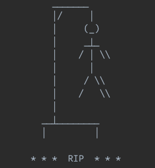

# Гра «Шибениця»

### Правила гри
Комп'ютер загадує слово (зі списку у файлі) і показує, скільки в ньому букв. Гравець вводить літери по одній. Якщо літерa є в слові, комп'ютер показує, скільки разів вона в ньому
зустрічається і на яких місцях. Якщо літери немає, комп'ютер зараховує помилку. Якщо слово відгадано повністю, гравець переміг. Після кожної помилки, домальовується
шибениця. Всього можна зробити 7 помилок.

### Додавання нових слів
Щоб додати слова, які будуть відгадуватись, потрібно зайти в папку `data` та додати у файл `words.txt` кожне слово з нового рядка великими літерами.

### Запуск гри
Щоб запустити гру, в терміналі перейдіть в корінь проекту і запустіть команду `ruby main.rb`.
